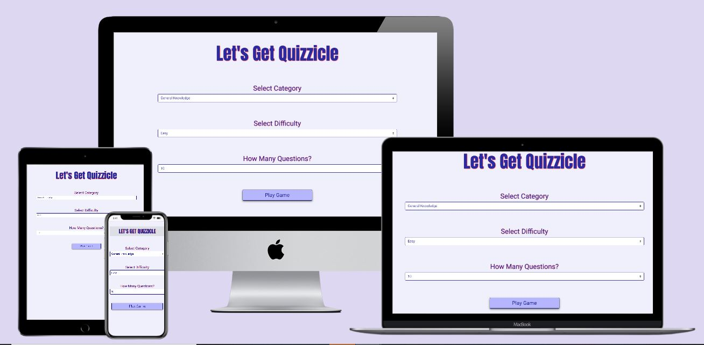
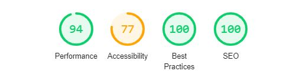

 # **Let's Get Quizzicle**  

This project is a Trivia Game suitable for people of all ages from the Opan Trivia API.
The game is a fun way for users to test their knowledge and learn something new.

# UX
The goal of this project is to provide users with a fun, easy to use trivia game based on their favourite categories. 
As the game is suitable for people of all ages, the webiste needs to be visually appealing to encourage user interaction and suitability for all different age groups.

### **User Goals:**
* For the game to be **responsive** on mobile, tablet & desktop.
* Visual interaction to draw the player in.
* **Different** choice of **categories** difficulty **levels** and **questions quantity** to suit a wider ranger of players.
* Point system to reward the player with the correct answer to the question.

### **User Story:**
* As a user, I would like to see a game that's suitabe for all gender and age group.
* As a user, I would like to see a game where I can pick my preferred Category and Level.
* As a user. I would like to see a game that's easy to navigate through.
* As a user, I would like to see a game that is visually appealing to draw me in.
* As a user, I would like to see a game that does not take too long to complete.
* As a user, I would like to see a game that involves a challenge and a reward  system for completion.
* As a user, I would like to see a game that will provide different questions.

## **Strategy**
The value of the game is that it is suitable for people of all ages and contains a wide variety of categories to satisy every user.
It also contains a variety of difficulty levels so suite those who are more expierenced and who wants to challenge themselves.

Target Audience - The target audience for this project can be anyone between the age of 15+.

Primary Audience-People who want to see how much they know about a particular topic and share this information with their friends.

The primary site goals are to offer a fun experience to users while teaching them some facts about different categories.

## Scope
The game is easy to use and pulls all the information from [Open Trivia DB](https://opentdb.com/).
Due to time restrictions I decided to remove the timer for the game and a scoreboard section that would have displayed the top 5 players.
The timer was displaying a bug (see Bugs below). I had created th scoreboard section but felt the scorebord should be based on the particular 
category chosen.

## **Structure:**
The game consists of 3 sections.   
The **First Section-** Contains the logo, 3 dropdown options **Category**, **Difficulty** and **Number of questions** and a **button** to start the game.   
The **Second Section-** Contains the **Questions**, that are pulled from the API, a **Question Counter**, players **Score points** and a **Quit Button**.  
The **Third Section-** Contains the **Game Over Page**, that will display the user's **Total Score** and a **Home Button**.

## **Skeleton:** 
My Wireframes:   
[Desktop](https://github.com/SophieH93/letsgetquizzicle/tree/master/wireframes/desktop)   
[Tablet](https://github.com/SophieH93/letsgetquizzicle/tree/master/wireframes/tablet)  
[Mobile](https://github.com/SophieH93/letsgetquizzicle/tree/master/wireframes/mobile)  
I created my wireframes on [MockFlow](https://www.mockflow.com/) for Desktop, Tablet and Mobie.  
 
The wireframes were originally created for a Marvel Theme trivia game but upon further research I realised that this was not possible as there was not a API for Marvel trivial questions.
The new wireframes were created for a general Trivia Games based on the [Open Trivia API](https://opentdb.com/).

## **Surface:**

### **Design Choice:**
    
**Font:** [Roboto](https://fonts.google.com/specimen/Roboto?query=ROBOTO&selection.family=Roboto#standard-styles) for the **body** and [Anton](https://fonts.google.com/specimen/Anton?query=ANTON) for **H1** headings. 
These fonts where choosen from [Google Fonts](https://fonts.google.com/). 
I initally chose Anton first for the heading and Google Fonts recommended Roboto as it's complimentary font.

**Colors:**   
As I wanted to create a game suitable for both gender's, I need to decide on nutual colors for the game. 
[Color Picker](https://htmlcolorcodes.com/color-picker/) allowed me to choose shades of **blue, purple and pink**.       
Background Color - **F0F0FB**
Font Color - **#2A2AA0**   
Text shadow with color **#FF0000** is used for the headings.   
Border, Submit, Select color - **#0A0A84**   
Submit hover has a box shadow with the colors - **#2196f3,  #fa00d9, #7c21f3**   
Select options, button border hover, username hover, - **#02024C**   
Button & container background color - **#B6B6FD**

### **Features of the Website:**
* [Open triia API](https://opentdb.com/)
* Bootstrap [buttons](https://getbootstrap.com/docs/4.3/components/buttons/) & [select menu](https://getbootstrap.com/docs/4.3/components/forms/#select-menu)
* Score system
* [Sweetalert](https://lipis.github.io/bootstrap-sweetalert/) - Used to display an alert for the incorrect answers.
* **Animation** used on the End page

### **Future Features:**   
* **Username Form** so the player can save their name 
* **Scoreboard** that displayes the **top 5** players depending on the Category they chose.
* **Countdown timer** to added more of a challenge.

# Technologies used
## Languages
* [HTML](https://developer.mozilla.org/en-US/docs/Web/HTML)
* [CSS](https://developer.mozilla.org/en-US/docs/Web/CSS)
* [Javascript](https://www.javascript.com/)

## Frameworks
* [Open Trivia DB](https://opentdb.com/)
* [Bootstrap](https://getbootstrap.com/docs/4.3/getting-started/introduction/)
* [Google Fonts](https://fonts.google.com/)
* [MockFlow](https://www.mockflow.com/)
* [Responsinator](https://www.responsinator.com/)

## Tools
* [GitHub](https://github.com/)
* [GitPod](https://www.gitpod.io/)
* [Git](https://git-scm.com/about)
* [W3C Markup Validation](https://validator.w3.org/)
* [WSC CSS Validaion](https://jigsaw.w3.org/css-validator/)
* [Dirty Markup Formatter](https://www.10bestdesign.com/dirtymarkup/)
* [W3School](https://www.w3schools.com/)
* [Color Picker](https://htmlcolorcodes.com/color-picker/)

# Testing

I used [Chrome DevTools](https://developers.google.com/web/tools/chrome-devtools) to test the **styling, layout and responsiveness** of the website on the different devices-Mobile, Tablet and Desktop.

I also used this to test my Javscript and fix any errors that arised.
Tested the responsiveness on various devices using [Responsinator](https://www.responsinator.com/?url=https://sophieh93.github.io/letsgetquizzicle/)

 [W3C Markup Validation](https://validator.w3.org/) & [WSC CSS Validaion](https://jigsaw.w3.org/css-validator/) was used to **validate** my **HTML & CSS** code.

**Lighthouse Test Result:**

# Bugs:
* **Bug:** I wanted to create a **score system** that added points when the player selected the correct answer and **minus** a **point** if the players 
selected the **wrong** answer. I was able to increment the score but encountered a issue when I tried to minus a point. DevTools console
was showing that my function was correct but not what the issue was.  
**The Fix:** With the help of a fellow student, the bug was eventually resolved by adding a console.log into the else statement. 

* **Bug:** When fetching the **questions** from the **API** there was a bug in the questions that had different symbols between the text e.g **&%#**
that I needed to remove.   
**The Fix:** I replaced the 'innerText' with **innerHTML** whicih then retrieves and sets the content in HTML format. 

* **Bug:** My **Scoreboard page** was not showing when the user clicked on the button.   
**The Fix:** After a couple days I realised that I had **'display:none'** in my css. Once this was removed the bug was fixed.

* **Bug:** The **Countdown timer** had a few bugs in it such as when the time ran out and the player was brought to the end page, if the player then clicked on the button to return
home, they home page would show but the **end page would not hide**.    
Another issue I was having with the timer was **resetting** the timer if the player clicked on the answer choice before the time ran out. The timer did not reset but
kept counting down.   
**The Fix:** Due to time, I decided to **remove** the timer completly.

**Bug:** This was mentioned by a fellow student that I had not noticed. When **clicking** to go to the **next question** the user can accidentally
press the next question.  
**The fix:** I amended the seconds of the timer to fetch the next question to 1 second.

# Deployment
I deployed the websit using GitHub's pages. The steps are as follows:

1. Open GitHub in the browser.
2. Sign into my account.
3. Select my repositories.
4. Navigate to letsgetquizzicle.
5. On the top right select settings.
6. Scroll down to the GitHub Pages area.
7. From the Source dropdown menu click on Master Branch.
8. Refresh the page and scroll back down to the GitHub Pages area to view the link to your live website.
 
 ### Running the website Locally:

To clone the quizgame from GitHub:

1. Navigate to SophieH93/letsgetquizzicle.
2. Click the green Clone or Download button.
3. Copy the url in the dropdown box.
4. Using your favourite IDE open up your preferred terminal.
5. Navigate to your desired file location.
6. Copy the following code and input it into your terminal to clone the game.

# Credits
* **Simen Daehlin** my mentor.
* **Slack Overview** for helping me with my score count and creating a unique URL for the API.
* [Youtube](https://www.youtube.com/watch?v=u98ROZjBWy8) - Build a quiz 
* [Youtube](https://www.youtube.com/watch?v=Syg_9iB1vco) - Animation

# Disclaimer
**This websit is for educational purposes only.**

